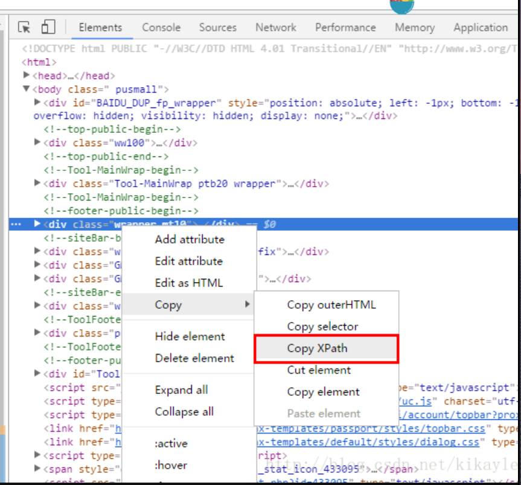

```python
#coding:utf-8
 
from lxml import etree
import  requests
from chardet import detect
 
url='https://book.douban.com/'
resp=requests.get(url,timeout=15)
ecoding=detect(resp.content).get('encoding')
html=resp.content.decode(ecoding)
tree=etree.HTML(html)
for book in tree.xpath('//div[@class="info"]'):
    title=book.xpath('.//a[@title]')[0].text.strip()
    author=book.xpath('.//div[@class="author"]')[0].text.strip()
print u'《',title,u'》','\t','--',author
```
